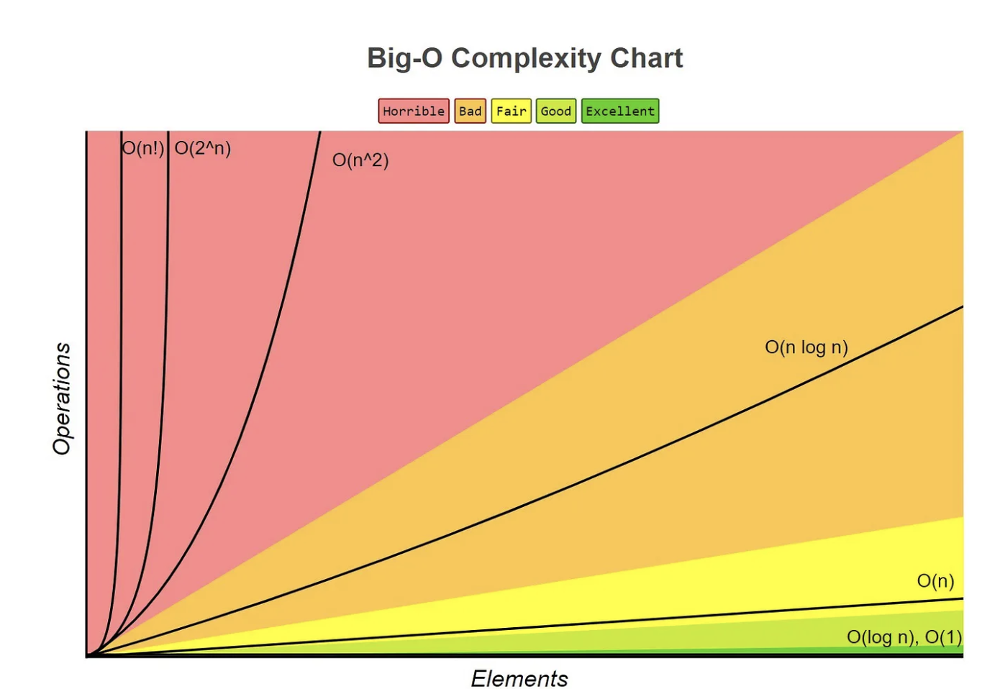
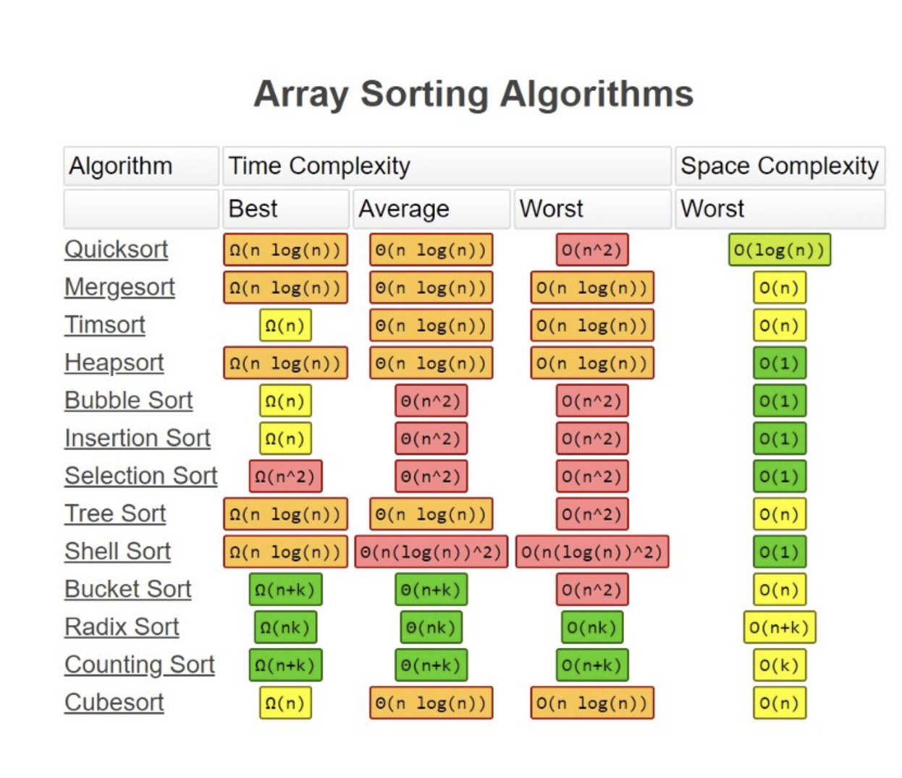
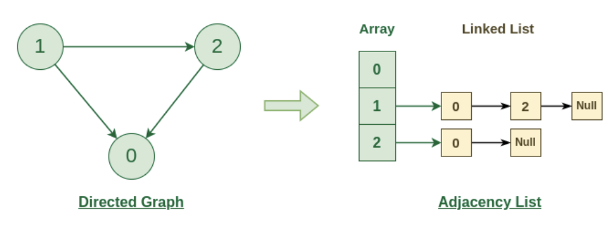
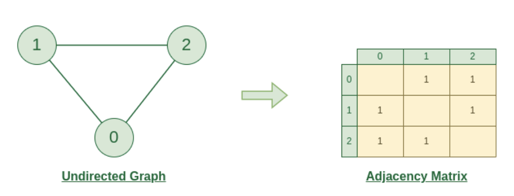

# Data Structures and Algorithms

Collection of coding algorithms and data structures, written in Javascript and Python, as well as problems / challenges using these algorithms (***See [challenges Readme](./challenges/README.md)***). Formatted in what you might see in LeetCode or interview questions.

----

##### This repository coincides with my blog post on this subject. Please refer to that for more in depth details and explanation of various algorithms:
* ##### [https://matt-crook.com/blog_posts/algorithms](https://matt-crook.com/blog_posts/algorithms)

----

##### Algorithms / Data Structures Include:
* Graph Traversal
* LinkedList Algorithms
* Stacks
* Queues
* Two Sum Algorithm
* Three Sum Algorithm
* Binary Search Algorithm
* Circular Buffer Algorithms
* Fizzbuzz
* Counting Algorithms
* Shuffling Algorithms
* Sorting Algorithms
* Searching Algorithms
* Finding Sums of Integers
* String Manipulation
* Fibonacci Sequence
* and more...
* [Challenges](./challenges/)

#### Extra/ Random / Docs:

##### Python:
- https://github.com/heineman/python-data-structures
- https://docs.python.org/3/library/collections.html#deque-recipes
- https://www.codecademy.com/resources/blog/advanced-python-code-challenges/

 

## Algorithm Space and Time Complexity and Big O Notation

In computer science algorithms, there is something called the “Big O Notation”. It primarily looks at how many operations a sorting algorithm takes to completely sort a very large collection of data. This is a measure of efficiency and is how you can directly compare one algorithm to another. All algorithms can be measured by this, in ***Time Complexity*** and ***Space Complexity***.

It is important to note that there *is no single algorithm that is fastest in all cases*, as data can be input into a program in all manners of states. And the approaches of each algorithm will have a best case and worst case scenario where they perform at their best or worst. So it is the programmers job (and your job in an interview for example) to leverage the best implementation to find the desired solution.

##### *Code Examples: [spaceAndTimeComplexity.js](./complexity/spaceAndTimeComplexity.js)*

##

***Time complexity*** is concerned with how the running time of an algorithm or function grows as the size of the input increases. We analyze the time complexity by counting the number of basic operations or steps the function performs, and then express that in Big-O notation.

***Space complexity*** is concerned with how much memory (space) an algorithm uses as a function of the input size. This includes the space used by variables, data structures, function call stacks, and so on.

Measuring Time and Space Complexity:

* Time Complexity: Focus on the loops, recursive calls, and nested operations. A good rule of thumb is:
  * Single loop: O(n)
  * Nested loops: O(n²), O(n³), etc.
  * Recursion depth: O(log n), O(n), depending on how the problem is divided.

* Space Complexity: Focus on extra space used, including:
  * Additional variables or data structures (arrays, dictionaries, etc.).
  * Space used by recursion (call stack depth).
  * Note that input data size is usually not counted unless we explicitly modify or store a large copy of the input.

In summary:

* Time complexity is measured by counting the number of operations relative to the input size.
* Space complexity is measured by considering how much extra memory the function uses.

 

*More details: https://www.freecodecamp.org/news/all-you-need-to-know-about-big-o-notation-to-crack-your-next-coding-interview-9d575e7eec4/*

##

<!-- ## Graph Search (BFS and DFS)

[Challenge Example](./challenges/javascript/adjancencyMatrix.js)

[Example Graph Traversal](./graphTraversal/)

#### Adjacency List
An adjacency list is the most common common way to represent a graph. Every vertex (or node) stores a list of adjacent vertices. In an undirected graph, an edge like `(a, b)` would be stored twice: once in `a's` adjacent vertices, and once in `b's` adjacent vertices.

#### Adjacency Matrix

An adjacency matrix is `N x N` boolean matrix (where `N` is the number of nodes), where a `true` value at `matrix[i][j] ` indicates an edge from node `i` to node `j`. You can also use an integer matrix with zeros and ones.

* In an undirected graph, an adjacency matrix will be symmetric. In a directed graph, it will not necessarily be.

The graph algorithms that are used on adjacency lists can be performed with adjacency matrices, but they may be somewhat less efficient. In the adjacency list representation, you can easily iterate through the neighbors of a node. In the adjacency matrix representation, you will need to iterate through all the nodes to identify a node's neighbors.

##### Algorithms

Two common ways to search a graph are ***Depth-First Search*** and ***Breath-First Search***.

[Example](./binarySearch/search.js)

In Depth-First Search (DFS), we start at the root (or another arbitrarily selected node) and explore each branch completely before moving onto the next branch. That is, we go deep first (hence the name depth- first search) before we go wide.

In Breath-First Search, we start at the root (or another arbitrarily selected note) and explore each neighbor before going onto any of their children. That is, we go wide (hence the name breath- first) before we go deep.

Breath-First Search (BFS) and Depth-First Search (DFS) tend to be used in different scenarios.

* DFS is often preferred if we want to visit every node in the graph. Both will work fine but depth first search is a bit simpler.
* However, if we want to find the shortest path or just any path between two notes BFS is generally better.

 

## Stacks

[Example](./stacksAndQueues/stack.js)

The stack data structure is precisely what it sounds like: a stack of data. In certain types of scenarios, it can be favorable to store data in a stack rather than in an array. A stack uses LIFO *(last-in, first- out)* ordering. That is, as in a stack of dinner plates. The most recent item added to the stack is the first item to be removed.

Unlike an array, a stack doesn't offer a consent-constant time access to the `i`th item. However, it does allow constant-time adds and removes as it doesn't require shifting elements around.

One case where stacks are often useful is in certain recursive algorithms. Sometimes you need to push temporary data onto a stack as you recurse, but then remove them as you backtrack (for example, because the recursive check failed.) A stack offers an intuitive way to do this. A stack can also be used to implement a recursive algorithm iteratively.

 

## Queues

[Example](./stacksAndQueues/queue.js)

A Queue implements FIFO *(first-in, first-out)* ordering. 
As in a line or queue at a ticket stand, items are removed from the data structure in the same order that they are added.

A queue can also be implemented with a linked list. In fact, they are essentially the same thing as long as items are added and removed from opposite sides.

One thing to note with a queue is, it is especially easy to mess up the updating of the first and last nodes.

One place are often used in breadth-first search, or an implementing a cache. In breadth-first search for example, we use a queue to store a list of nodes that we need to process. Each time we process a node, we add its adjacent nodes to the back of the queue. This allows us to process nodes in the order in which they are viewed.

 

## HashMap

*(https://levelup.gitconnected.com/java-hashmap-explained-a601c48ddc44)*

[Example Python](./challenges/python/hashmap_ransomNote.py)

[Example Javascript](./challenges/javascript/hashmapRansomNote.js)

[Example Two Sum](./challenges/javascript/twoSum.js)

A HashMap or Hash Table is a data structure that maps keys to values for highly efficient lookups. There are a number of ways of implementing this.
A simple implementation is we can use an array of linked lists, and a hash code function.

Alternatively, we can implement a look up system with a balanced binary search tree. The advantage of this is potentially using less space since, we no longer allocate a large array. We can also iterate through the keys in order; which can also be useful sometimes.

 

## LinkedLists

[Examples](./linkedList/)

A Linked List is a data structure that represents a sequence of nodes. In a singly Linked List, each Node points to the next Node in the Linked List. A doubly Linked List gives each Node pointers to both the next Node and the previous Node. Unlike an array, a linked list does not provide constant time access to a particular index within the list.

 

## Fibonacci

[Examples](./fibonacci/)

The Fibonacci sequence is the series of numbers where each number is the sum of the two preceding numbers. It starts with 0 and is followed by 1.

 

## Circular Buffer

[Examples](./circularBuffer/)

[Challenge Example](./challenges/python/circlular_buffer.py)

A a circular buffer (or circular queue, cyclic buffer or ring buffer) is a data structure that uses a single, fixed-size buffer as if it were connected end-to-end. This structure lends itself easily to buffering data streams. The useful property of a circular buffer is that it does not need to have its elements shuffled around when one is consumed. -->
